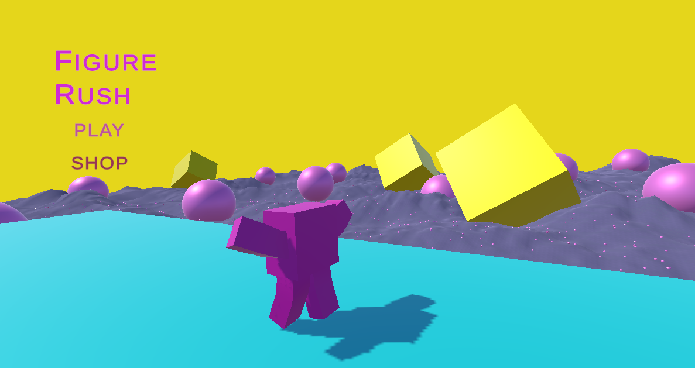
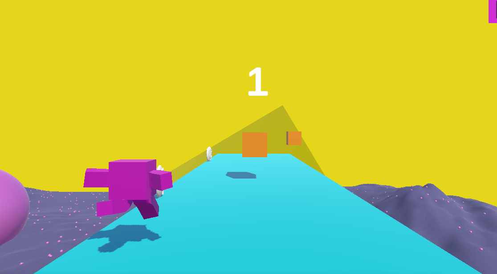
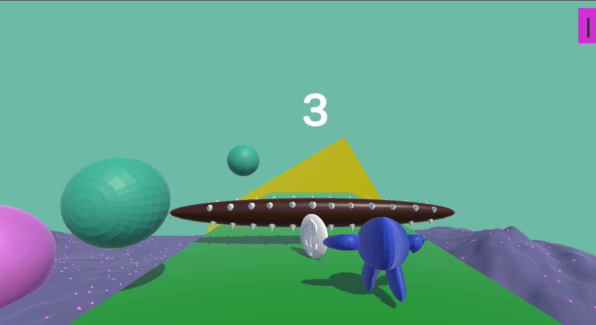

# Figure Rush

**Figure Rush** is an exciting avoiding objects game developed in Unity, where players must navigate through a challenging environment, avoid obstacles, and collect power-ups to achieve high scores. Customize your gameplay experience with unlockable skins from the in-game shop.

## Features

- **Engaging Gameplay:** Dodge obstacles and test your reflexes.
- **Shop:** Visit the shop to unlock new skins using in-game currency.
- **Intuitive Controls:** Easy-to-use controls for a smooth gaming experience.

## Screenshots

| Menu | Gameplay1 | Gameplay2 |
|---|---|---|
|  |  |  |

## Getting Started

### Prerequisites

- **Unity:** Make sure you have Unity installed. Download it from [here](https://unity.com/).

### Installation

1. Clone this repository: `git clone https://github.com/your-username/Figure-Rush.git`
2. Open the project in Unity.
3. Navigate to the `Scenes` folder and open the `Starting-Scene.unity` scene.
4. Press the Play button in Unity to run the game.

## How to Play

- Use the arrow keys or ASD and Space to control your character's movement.
- Avoid colliding with obstacles to stay in the game.
- Earn in-game currency by achieving high scores.
- Visit the shop in the main menu to unlock new skins.

## Contributing

Contributions are welcome! If you'd like to contribute to Figure Rush, please follow these steps:

1. Fork the repository.
2. Create a new branch for your feature: `git checkout -b feature-name`
3. Make your changes in Unity and test them thoroughly.
4. Commit your changes: `git commit -m "Add feature"`
5. Push to the branch: `git push origin feature-name`
6. Create a pull request detailing your changes.

## License

This project is licensed under the [MIT License](LICENSE).

## Contact

For any inquiries or suggestions, feel free to reach out to us at cylwikbartosz@gmail.com.

---

*Game developed by Bartosz Cylwik (https://github.com/Banjo7331)*

[Optional: Badges, acknowledgments, additional sections as needed]
